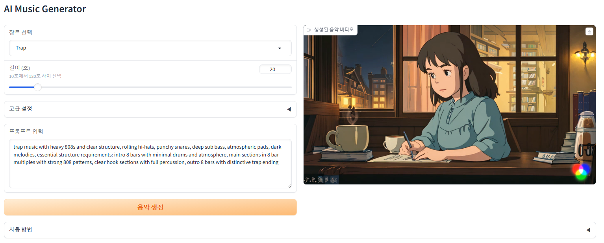

# 🎵 AI 음악 생성기 (AI Music Generator) 🎶

## 1. 프로그램 개요
이 프로그램은 AI를 활용하여 다양한 장르의 음악을 생성하는 도구입니다. Facebook의 MusicGen 모델을 기반으로 하며, 생성된 음악에 맞춰 시각적 효과를 자동으로 생성합니다.

주요 기능:
- 🎧 다양한 장르의 음악 생성 (City Pop, Lo-Fi, Future Bass 등)
- 🌐 웹 인터페이스를 통한 쉬운 조작
- 🎥 음악과 시각효과가 결합된 비디오 출력
- ⚙️ 상세한 음악 생성 파라미터 조정 가능

## 2. 작성 환경
- 🐍 Python 3.11
- 🖥️ Windows 10
- ⚡ CUDA 지원 GPU 권장

## 3. 프로그램 설치 방법

### 가상환경 설정
```bash
# 가상환경 생성
python -m venv edm_env

# 가상환경 활성화
## Windows
edm_env\Scripts\activate
## Linux/Mac
source edm_env/bin/activate
```

### 필수 라이브러리 설치
```bash
# 가상환경이 활성화된 상태에서 실행
pip install torch torchvision torchaudio
pip install audiocraft
pip install moviepy
pip install gradio
pip install numpy
```

### 프로젝트 파일 구조
```
project/
│
├── main.py              # 핵심 생성 로직
├── web_app.py          # 웹 인터페이스
├── youtube_gif_new.mp4 # 기본 애니메이션 파일
└── README.md
```

## 4. 프로그램 구동 방법

### 가상환경 활성화 후 실행
```bash
# 1. 가상환경 활성화
## Windows
edm_env\Scripts\activate
## Linux/Mac
source edm_env/bin/activate

# 2. 프로그램 실행
## CLI 모드
python main.py
## 웹 인터페이스
python web_app.py
```

## 5. 사용 방법

### 웹 인터페이스 미리보기 👀

*AI 음악 생성기 웹 인터페이스*

### 웹 인터페이스 사용
1. 🎼 장르 선택 (City Pop, Lo-Fi, Future Bass 등)
2. ⏱️ 음악 길이 설정 (10-120초)
3. 🔧 필요시 고급 설정 조정
4. ✏️ 프롬프트 입력 또는 수정
5. 🎬 '음악 생성' 버튼 클릭

### 고급 설정 설명
- BPM: 음악의 템포
- Temperature: 생성의 무작위성 정도
- Top K: 토큰 선택 범위
- Top P: 확률 임계값
- CFG Coefficient: 프롬프트 준수 강도

## 6. 수정 가능한 변수값

### 장르별 기본 설정

#### City Pop 설정
- BPM: 104
- Duration: 60초
- Temperature: 0.65
- Top K: 150
- Top P: 0.85
- CFG Coefficient: 3.5

#### Lo-Fi 설정
- BPM: 75
- Duration: 300초
- Temperature: 0.3
- Top K: 40
- Top P: 0.7
- CFG Coefficient: 5.0

#### Future Bass 설정
- BPM: 150
- Duration: 45초
- Temperature: 0.7
- Top K: 250
- Top P: 0.9
- CFG Coefficient: 3.0

기타 장르들도 비슷한 방식으로 설정 가능합니다.

### 시스템 설정
- CUDA_LAUNCH_BLOCKING: '1'
- PYTORCH_CUDA_ALLOC_CONF: 'max_split_size_mb:128'
- 비디오 출력 FPS: 24
- 비디오 코덱: 'libx264'
- 오디오 코덱: 'aac'

### 주의사항
- GPU 메모리 사용량이 높으므로 충분한 VRAM 확보 필요
- 생성된 파일은 30분 후 자동 삭제됨
- 프롬프트는 영어로 입력해야 최적의 결과를 얻을 수 있음
